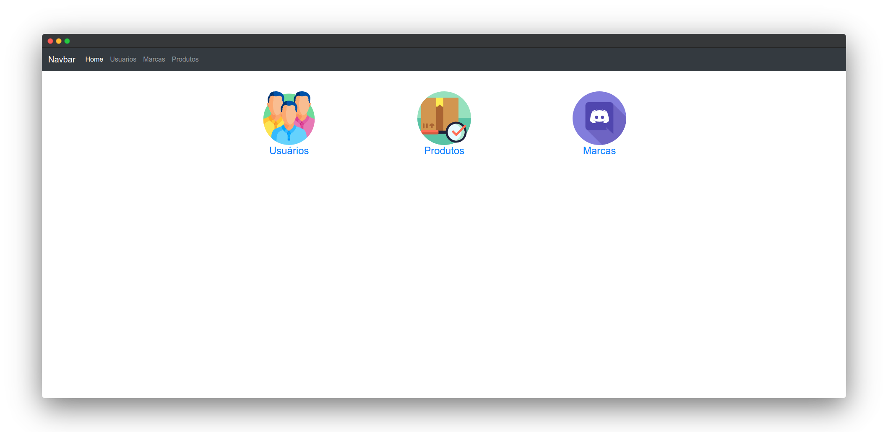
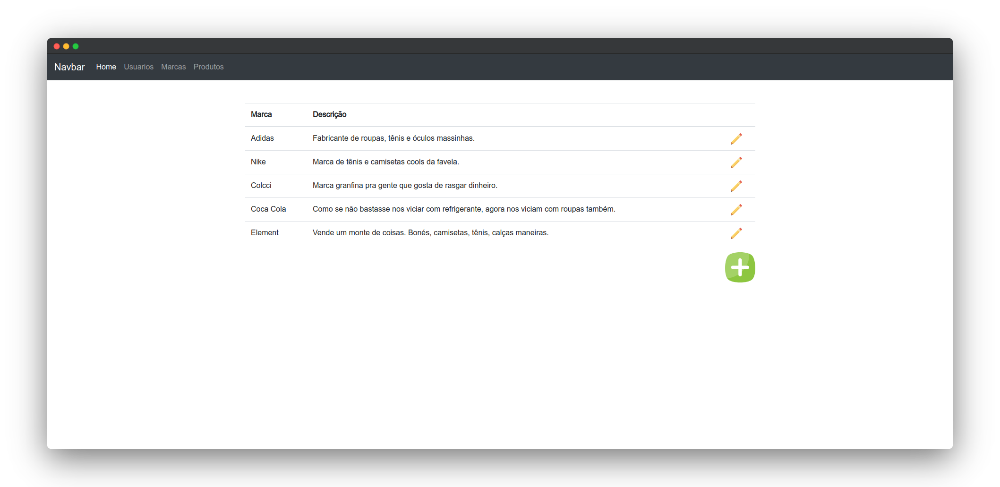
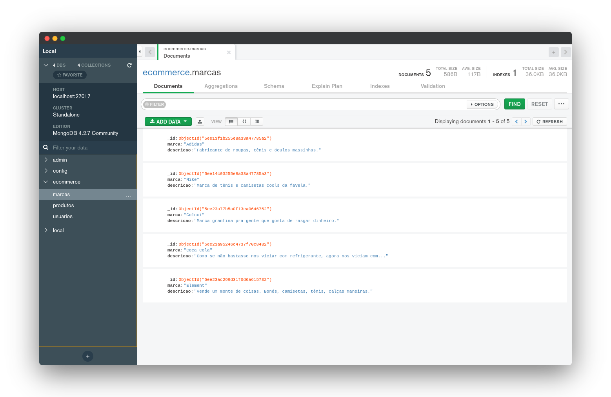

<h3 align="center">
    
    <br><br>
    <b>Aplicação MVC PHP + MongoDB</b>
    <br>
    <code>Desenvolvido por: <a href="https://github.com/mrbrunelli" target="_blank">Matheus R. Brunelli</a></code>
</h3>

<br>
<br>
<center>

### :elephant: + :fallen_leaf: Banco de Dados Avançado
:mortar_board: Aula ministrada pelo [Professor Márcio](https://github.com/marciock)

<br>
<br>

Essa aplicação está utilizando Docker. Para executa-lá navegue até a pasta raiz do projeto e digite:
```docker
    docker-compose up -d
```

<br>
<br>

### :fireworks: Screenshots da aplicação

Home


Marcas


Mongo Compass


</center>
